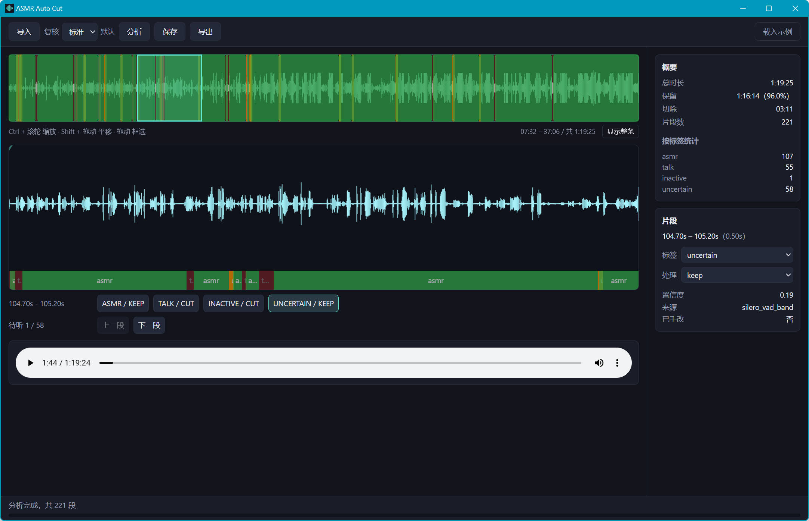
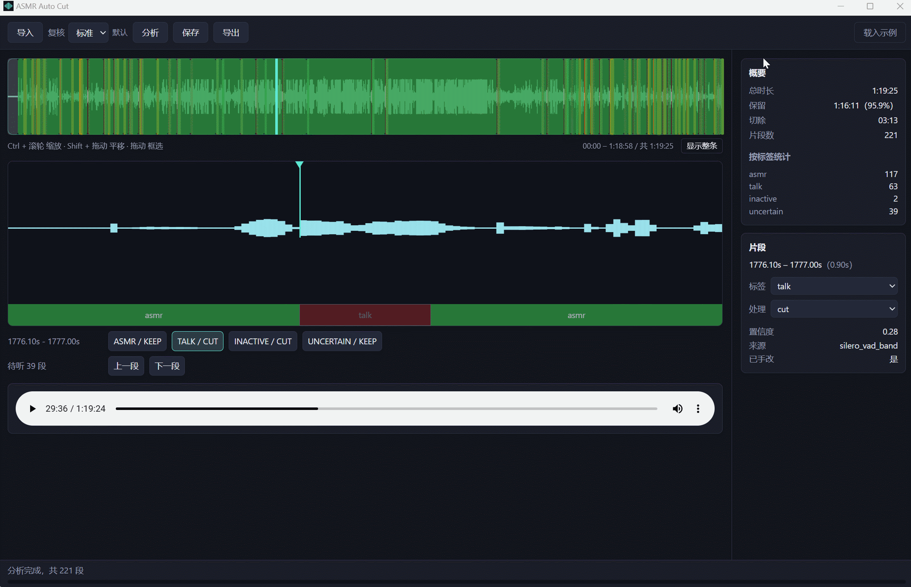

# ASMR Auto Cut

[English](README.md) · **中文**

> 从长时间的 ASMR 录像里挑出值得保留的部分，切掉闲聊和静默。桌面应用，**全程本地处理，
> 不上传任何东西**。

一场直播录下来动辄几个小时，真正想留的可能只有其中一部分，而手工在时间轴上拖拽要花很久。
这个工具先自动判断每段内容是语音、静默还是 ASMR，把结果画在原始波形上，你沿着时间轴逐段
复核修正，再把保留的部分导出成一个文件。

它是刻意做成**辅助而非全自动**的：耳语和轻触发声很容易被当成说话，所以复核是流程的一部分，
不是可选项。


## 功能

- **纯本地。** 没有账号、不联网、不上报。录音不会离开这台机器。
- **上下两层时间轴。** 上层看整条录音，下层看你框选的那一段，两层独立缩放、双向联动。
- **逐段复核。** 点一个色块从它的起点开始播放，用预设按钮改标签，改动立刻反映在画面上；
  被标成 `cut` 的段落显示得更透明。
- **复核细致程度可选。** 快速 / 标准 / 细致，决定多宽的「拿不准」会被标出来给人听。
- **进度看得见。** 分析和导出都会显示当前阶段和百分比，而不是把窗口卡住。
- **视频轨原样透传。** 导出时视频走流拷贝，速度只受磁盘限制，不重编码。
- **自带命令行。** 后端本身就是一个独立 CLI，可以批处理、可以脚本化，也可以完全不用界面。


## 安装

### Windows 安装包

从 Releases 下载 `.msi` 或 `-setup.exe` 直接安装。**所有东西都打在包里——不需要 Python、
不需要 ffmpeg、也不需要联网。**

- **第一次启动会让你选一个数据目录。** 中间产物和导出成片都往那儿落，所以不替你决定写哪儿。
  选择记在 `%APPDATA%\com.asmrautocut.desktop\config.json`。
- 想固定一个位置就设 `ASMR_AUTO_CUT_DATA`，批处理时最省事。

安装目录里的后端也可以直接调：

```powershell
& "$env:LOCALAPPDATA\ASMR Auto Cut\backend\asmr-auto-cut.exe" analyze input.mp4 --project-dir E:\data\example
```

安装包体积和装完占多少，见下面的[打包](#打包)。

### 从源码运行

需要 Python 3.11+、Node.js 18+ 和 Rust 工具链。`ffmpeg` 和 `ffprobe` 必须在 PATH 上
——分析和导出都要调它们。

```powershell
git clone https://github.com/zaughterCoding/ASMR-Auto-Cut.git
cd ASMR-Auto-Cut

python -m venv .venv
.\.venv\Scripts\python.exe -m pip install -e ".\backend[dev]"
# 语音检测（Silero VAD，跑在 ONNX Runtime 上）。权重随包走，不用另外下载。
.\.venv\Scripts\python.exe -m pip install -e ".\backend[ml]"

cd app
npm install
npm run tauri dev
```

非开发构建下，界面按名字从 PATH 找后端。开发时后端通常只装在虚拟环境里，用环境变量指过去：

```powershell
$env:ASMR_AUTO_CUT_BIN = "<仓库路径>\.venv\Scripts\asmr-auto-cut.exe"
npm run tauri dev
```

## 怎么用

```text
导入 → 分析 → 在波形上复核并修正 → 保存 → 导出
```

1. **导入**：选一段录音或录像。
2. **分析**：抽出音频、跑语音检测和静默检测，把整条录音切成若干段落。每段带一个标签
   （`asmr` / `talk` / `inactive` / `uncertain`）和一个处理方式（`keep` / `cut`）。
3. **复核**：在上层波形上拖一段选定范围，下层自动缩放过去；点色块试听，用右侧预设按钮改标签。
4. **保存**：改动写回 `segments.json`。
5. **导出**：只保留标记为 `keep` 的段落，按顺序拼成一个新文件。

### 时间轴操作

| 操作 | 上层（概览） | 下层（缩放） |
|---|---|---|
| 普通拖动 | 框选一个范围 | — |
| 拖动已有的选区框 | 把选区搬到别处 | — |
| `Ctrl` + 滚轮 | 缩放视野 | 缩放选中的范围 |
| `Shift` + 拖动 | 平移视野 | — |
| 点一下段落色块 | 选中它 | 选中它 |
| 拖动顶部的倒三角 | — | 设置播放起点 |

### 命令行

```powershell
# 分析，结果写进项目目录
asmr-auto-cut analyze input.mp4 --project-dir data/projects/example

# 按时间轴导出
asmr-auto-cut export data/projects/example/segments.json --output clean.mp4

# 进度以 NDJSON 逐行打到 stdout，每行一条 JSON
asmr-auto-cut analyze input.mp4 --project-dir data/projects/example --progress-json
```

`--progress-json` 下 stdout 每行一条 JSON：`{"type":"progress",...}` 是进度，最后一条是
`{"type":"result",...}`。人看的进度文字走 stderr，两种输出不会互相污染。

`--review quick|standard|thorough` 决定多宽的「拿不准」会被标出来给人听。
`--mode quality|fast` 用在 `export` 上，拿掉淡入淡出换一点速度；差距只有约 5%，
用默认的 `quality` 就好。

一个项目目录里：

```text
project.json     源文件信息 + 分析时的时间轴
segments.json    编辑后的时间轴，界面和导出都以它为准
waveform.json    波形采样点，每秒 20 个，供界面绘制
```

抽出来的 `analysis.wav` 是中间产物（8 小时录音约 0.9GB），分析成功后自动删除；分析中途
失败时会留在原地方便排查。

## 支持的格式

**作为输入**：所有 ffmpeg 能解的格式，包括 `.mp4` `.mkv` `.flv` `.ts` `.mov` `.mp3`
`.m4a` `.flac` `.wav` `.aac` `.ogg` 等等。

**界面内试听**用的是系统的 WebView2（Chromium 内核），它支持的容器比 ffmpeg 窄。这条限制
**只影响「听着剪」，不影响分析和导出**——放不了的封装照样能切、能导。

| 扩展名 | 试听 |
|---|---|
| `.mp3` `.wav` `.flac` `.m4a` `.aac` `.ogg` / opus | ✅ |
| `.mp4` `.mov` `.mkv` | ✅（只播音轨） |
| `.flv` `.ts` | ❌ `SRC_NOT_SUPPORTED` |

试听能力取决于 WebView2 的版本，换一台机器可能不同。放不了的话先转一道，不影响后续流程：

```powershell
ffmpeg -i input.flv -vn -c:a aac output.m4a
```

## 实现

```
源文件 ──ffmpeg──▶ 16 kHz 单声道分析音频 ──┬──▶ 波形采样点（每秒 20 个）
                                          │
                                          ├──▶ Silero VAD（ONNX）──┐
                                          │                        ├──▶ 合并与微调
                                          └──▶ 静默检测 ───────────┘        │
                                                                            ▼
                                                        段落：标签 + keep/cut
                                                                            │
                                                    人工复核 ◀───────────────┘
                                                          │
                                                          ▼
                              导出：-c:v copy + AAC 重编码，音频首尾各 30ms 渐变
```

语音和静默是**两套独立的检测器**。它们给出的区间会先合并，再按检测到的边界切开并微调，
最后才成为段落——所以切点落在音频真正变化的地方，而不是固定的网格上。

导出会把音频重编码成 AAC 192k，每个保留段首尾各加 30ms 渐变：两段不相关的波形硬接在
一起会「啪」一声。这个渐变是音频必须重编码的**唯一**原因，视频轨是流拷贝的。

输出容器取决于源文件有没有视频轨——流拷贝的视频轨得装得进容器：

| 扩展名 | 视频源 | 纯音频源 |
|---|---|---|
| `.mp4` `.mkv` `.mov` | ✅ | ✅ |
| `.m4a` | ❌ | ✅ |
| `.aac` | ⚠️ 视频轨被静默丢掉 | ✅ |
| `.mp3` `.flac` | ❌ | ❌ |
| `.wav` | ⚠️ 非标准的 AAC-in-WAV | 同左 |

**录像用 `.mp4`，只要音频用 `.m4a`。** 选错了不会损坏源文件，重新导一次即可。

## 已知限制

- **目前只在 Windows 上验证过。** Tauri 本身跨平台，这里也没有刻意写死 Windows 的东西，
  但其他平台没测过。
- **它会误判。** 部分耳语和轻触发声会被当成说话，这正是复核那一步要解决的问题。
- **`waveform.json` 偏大。** 每秒 20 个采样点，每点约 50–70 字节，8 小时录音约 30–40MB。
  界面会把它整份读进内存，很长的录音打开会变慢。
- **复核是纯手工的。** 你改过的段落没有「自动应用」；改动存在 `segments.json` 里，
  下次分析从头开始。

## 打包

```powershell
cd app
npm run bundle          # = freeze:backend + tauri build
```

`freeze:backend` 用 PyInstaller 把后端冻成自包含的一坨，产物落在
`src-tauri/resources/backend/`；`tauri build` 再把它和 ffmpeg 一起打进安装包，
资源由 `tauri.conf.json` 的 `bundle.resources` 声明。

一次性前提：

```powershell
.\.venv\Scripts\python.exe -m pip install -e ".\backend[dev]"   # 会带上 PyInstaller
powershell -File app\scripts\vendor-ffmpeg.ps1                  # 拉取钉死版本的 LGPL ffmpeg
```

Windows 实测体积：

| 产物 | 大小 |
|---|---|
| `target/release/asmr-auto-cut.exe`（界面外壳） | 8.8 MB |
| `src-tauri/resources/backend/`（冻结后端） | 98.6 MB |
| `src-tauri/resources/ffmpeg/`（LGPL 构建） | 147.6 MB |
| `ASMR Auto Cut_0.4.0_x64_en-US.msi` | **108.0 MB** |
| `ASMR Auto Cut_0.4.0_x64-setup.exe` | **81.4 MB** |

装完占 **254.8 MiB**，138 个文件。大头省不掉：`onnxruntime` 一个就 35.8 MB，numpy 的 BLAS
20.2 MB，CPython 运行时再加约 18 MB。NSIS 比 MSI 小 26.6 MB 纯粹是压缩算法不同，
装的东西**逐字节相同**。

## 开发

```powershell
# 后端
cd backend
..\.venv\Scripts\python.exe -m pytest -v

# 前端
cd app
npm test          # vitest
npm run build     # tsc + vite
```

## 贡献

欢迎提 issue 和 PR。开发环境、目录结构，以及动流水线或导出路径之前该知道的几个坑，
都写在 [CONTRIBUTING.md](CONTRIBUTING.md) 里。

## 许可证

[MIT](LICENSE)。

安装包里打包了若干第三方组件，各自的许可证随二进制一起分发：

| 组件 | 许可证 | 说明 |
|---|---|---|
| FFmpeg（`ffmpeg.exe` / `ffprobe.exe` + 若干 DLL） | **LGPLv3** | [BtbN/FFmpeg-Builds](https://github.com/BtbN/FFmpeg-Builds) 的 `win64-lgpl-shared` 构建；完整文本见安装目录下的 `ffmpeg\LICENSE.txt` |
| Silero VAD（`silero_vad.onnx`） | MIT | 模型权重 |
| ONNX Runtime | MIT | 语音检测的推理运行时 |
| CPython 及依赖 | PSF / MIT / BSD | 由 PyInstaller 冻结 |

FFmpeg 选的是 **LGPL 构建而不是 GPL**，这是有意的：本项目只用到 `-c:v copy`、`-c:a aac`、
`afade`、`concat`，全部落在 LGPL 覆盖的范围内，不涉及任何 GPL 编码器。LGPLv3 要求随二进制
提供许可证文本和源码获取方式，分别对应安装目录里的 `ffmpeg\LICENSE.txt` 和上面的 BtbN 仓库地址。
